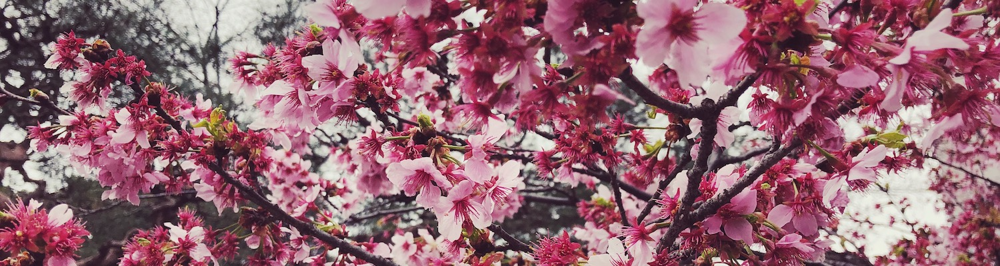

<h1 align="center" >Hi, I'm <a href="https://www.linkedin.com/in/harsha-umesh/" target="_blank"> Harsha Umesh </a> </h1>

I'm Full Stack Developer with a serious passion for UI effects, animations and creating intuitive user experiences. Being Passionate for technology 💻 and having a desire to learn and explore more 💭 makes me what I am. 

- 🔭 I’m currently working on improving my coding skills.
- 🌱 I’m currently learning Web development and React.
- ⚡ Fun fact: When I'm not developing and coding, you can find me watching Anime, Netflix, Sports😂.
- 📫 How to reach me **harshau129@gmail.com**
- 💻<a target="_blank" href="https://harshau9.github.io/"> Check out my portfolio</a>

## 🌐<i>Connect with me</i>

 
 

<h2><i> Languages and Tools</i></h2>

  <a href="">
    
<!--     
    
    
    
    
    
    
     -->
  </a> 

 

<h2><i>GitHub Stats</i></h2>

    
    
    
 

  
 

    

  
 

    

  

  

  

<!--  -->
